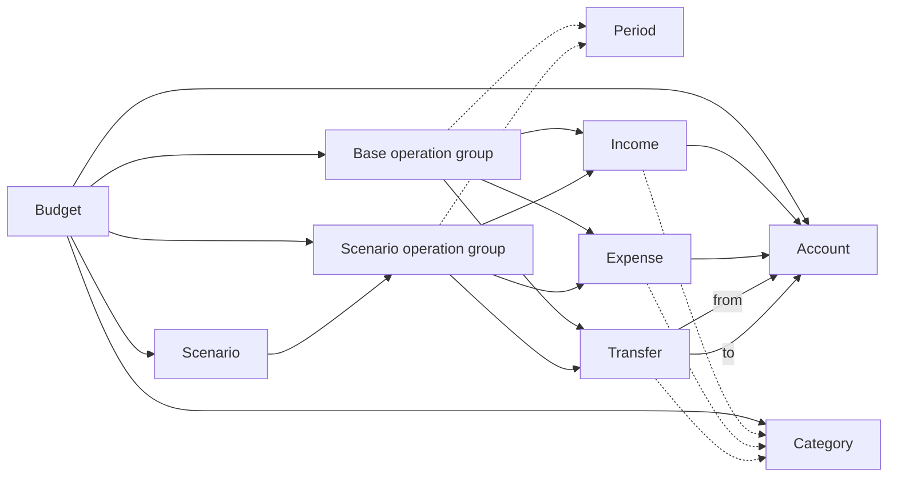

# Budget Planner Domain Model

## Purpose

The planner describes a budget over one or more periods and lets users compare several possible futures. A budget contains opening account balances, base operations, and mutually exclusive sets of scenario operations.

The main calculation results are income, expenses, and balances by account and category:

1. for base operations alone;
2. for each scenario alone;
3. for the base combined with each scenario.

The budget is the aggregate root: references to accounts, categories, and scenarios are resolved only within the same budget.



## Entities

### Budget

A budget brings together the reference data and operations needed for one or more calculation periods.

A budget has:

- an optional title;
- a display language;
- zero or more currency declarations;
- an ordered list of accounts;
- an ordered list of scenarios;
- an ordered list of categories;
- any number of operation groups.

Account and category order matters for presentation: the report sorts operations first by account order, then by category order. Operations without a category appear after the declared categories for their account.

The title is used as the report heading. The language determines interface labels. Monetary values in the report use the symbol of the first declared currency; a separate currency cannot currently be assigned to an account or operation.

### Account

An account represents a place where money is held, such as a bank account, cash, or another wallet.

Account properties:

- a unique, nonempty identifier;
- a display name;
- an opening balance, which defaults to zero.

The opening balance is a signed number: it may be positive, zero, or negative. Income and expense operations each refer to one account. A transfer refers to a source and a destination account.

### Scenario

A scenario describes one possible version of the budget, such as "car sold" or "car not sold".

Scenario properties:

- a unique, nonempty identifier;
- a display name.

A scenario does not contain operations directly. Operation groups for different periods are associated with it. A declared scenario may have no operation group; in that case, its own effect is zero.

Scenarios are not combined with one another. Each combined result consists of the base plus one selected scenario.

### Category

A category classifies operations by purpose.

Category properties:

- a unique, nonempty identifier;
- a display name;
- a type: `income`, `expense`, or `transfer`.

A category's type must match the operation's type. Income cannot use an expense category, and a transfer cannot use an income category. A category is optional; the total of uncategorized operations is tracked separately as "Uncategorized".

### Operation group

An operation group assigns all its operations to the base or to one scenario and, optionally, to a calendar period.

There are two kinds of group:

- **Base group:** the `scenario` attribute is absent, empty, or contains only whitespace.
- **Scenario group:** `scenario` contains the identifier of a declared scenario.

An optional period contains one value or two range boundaries separated by whitespace. Each value uses one of these formats:

- `YYYY`: a year, for example `2026`;
- `YYYY-MM`: a month, for example `2026-09`.

Examples of ranges:

- `2026-09 2026-10`: a budget covering the two specified months;
- `2026 2027`: a budget covering the two specified years.

At most two values are allowed. Whitespace between them is normalized, so `2026  2027` and `2026 2027` designate the same period.

The combination of normalized `scenario` and `period` must be unique. A scenario can therefore have groups for different periods, but cannot repeat the same period. An absent `period` also participates in the uniqueness key as a distinct empty value. Any number of groups, including zero, is allowed.

The period groups operations in the HTML report. Periods appear in the order of their first occurrence in the XML. A monthly value such as `2026-10` is displayed as `2026 October`, and range boundaries in a heading are separated by a dash. Within each period, the base, each scenario's operations, and each base-plus-scenario result are calculated separately, so amounts and operation lists from neighboring periods do not mix. Groups without a `period` form a separate "No period" block.

Balances carry forward between periods in that same order. For the first period, the account's `balance` is the opening balance for both the base and each combined scenario result. The next period's opening balance is the previous period's closing balance in the same calculation path:

- the base continues from the previous base result;
- scenario operations continue the cumulative effect of that scenario alone, starting from zero;
- a base-plus-scenario result continues from the previous result for that same base-and-scenario pair.

For each account in a period:

```text
net change = period income − period expenses
closing balance = opening balance + net change
```

The terminal text report remains a summary and sums matching operations across all periods. A range does not itself multiply operation amounts; use `count` to repeat an operation.

The `scenario` attribute belongs to the group, not to an individual operation. All operations in a group have the same scenario association.

### Operation

An operation is a planned movement of money. Common properties are:

- an optional description;
- a nonnegative amount per unit;
- an optional nonnegative integer count;
- an optional category of the matching type;
- optional dates;
- membership in an operation group.

If the count is absent, it defaults to one. The effective amount is:

```text
effective amount = amount per unit × count
```

A count of zero is allowed and produces an effective amount of zero. Monetary calculations are exact, without binary floating-point rounding.

Dates are used for presentation and do not affect amounts. Dates in `YYYY-MM-DD` format are displayed as `YYYY.MM.DD`; multiple values are separated by a dash.

#### Income

Income credits the effective amount to the specified account:

```text
account income += effective amount
```

Income increases both the account balance and the budget's overall balance.

#### Expense

An expense debits the effective amount from the specified account:

```text
account expenses += effective amount
```

An expense decreases both the account balance and the budget's overall balance.

#### Transfer

A transfer moves the effective amount between two accounts:

```text
source account expenses += effective amount
destination account income += effective amount
```

A transfer affects the balances of the participating accounts but is not counted as external budget income or expense. It therefore does not change the budget's overall balance.

## Calculation views

The report produces three views of the same entities.

### Base operations

This view includes only base groups. The first period includes the account's opening balance; later periods use the closing balance of the previous base period:

```text
account balance = opening balance + income − expenses
overall balance = sum of opening balances + external income − external expenses
```

### Scenario operations

This view includes only the selected scenario's operations. Opening balances and base operations are excluded. The first period starts at zero; later periods include that scenario's cumulative effect:

```text
account change = previous change + scenario income − scenario expenses
overall change = previous overall change + external scenario income − external scenario expenses
```

### Combined scenario result

This view includes base operations and the operations of one selected scenario. The first period starts with the opening balance; later periods start with the previous result for the same base-and-scenario pair:

```text
account balance = opening balance
                + period base income − period base expenses
                + scenario income − scenario expenses
```

Base and scenario operations remain visually separate in the combined operation list.

In the HTML report, accounts appear as compact cards. For the base and individual scenarios, the cards show income, expenses, and balance for the current period only. Opening balance and overall balance appear in the "base + scenario" results, where they describe the account's complete state. Categories remain next to the operation list, and tabs switch between multiple scenarios within a section; the period menu opens the selected scenario directly.

## Aggregation

Each view calculates:

- each account's opening balance, income, expenses, net change, and closing balance;
- totals for income, expense, and transfer categories;
- totals for uncategorized operations;
- overall external income and expenses;
- the budget's overall balance or change.

Categories with a zero total are hidden. Transfers appear in individual account figures and transfer categories, but are excluded from overall external income and expenses.

## Invariants

A valid budget follows these rules:

1. Accounts, scenarios, and categories have nonempty identifiers that are unique within their respective types.
2. An account's opening balance is a finite numeric value.
3. An operation group refers only to a declared scenario.
4. Each combination of normalized `scenario` and `period` is unique among operation groups; absent, empty, and whitespace-only `scenario` values are equivalent.
5. If present, `period` contains one or two values in `YYYY` or `YYYY-MM` format, with a month from `01` through `12`.
6. An operation cannot declare its own scenario.
7. Income and expenses refer to an existing account.
8. Transfers refer to existing source and destination accounts.
9. An operation's category exists and matches the operation's type.
10. An operation's amount is nonnegative.
11. The count is a nonnegative integer.
12. The budget title and language setting appear at most once each.

## Example of entity interaction

```xml
<budget>
    <head>
        <title>October 2026 Budget</title>
        <translation>en</translation>
        <currency symbol="€">EUR</currency>

        <account description="Bank" balance="250">bank</account>
        <account description="Cash">cash</account>

        <scenario description="Car sold">car-sold</scenario>
        <category type="income" description="Salary">salary</category>
        <category type="expense" description="Insurance">insurance</category>
        <category type="transfer" description="Cash withdrawal">withdrawal</category>
    </head>

    <operations period="2026-10">
        <income account="bank" category="salary">1500</income>
        <transfer from="bank" to="cash" category="withdrawal">200</transfer>
    </operations>

    <operations scenario="car-sold" period="2026-10">
        <expense account="bank" category="insurance">100</expense>
    </operations>
</budget>
```

Here the base balance of the bank account is `250 + 1500 − 200 = 1550`, and the cash balance is `0 + 200 = 200`. The transfer changes how money is distributed between accounts but does not change the overall balance of `1750`. In the `car-sold` scenario, the expense reduces both the bank account's combined balance and the budget's overall balance by `100`.
