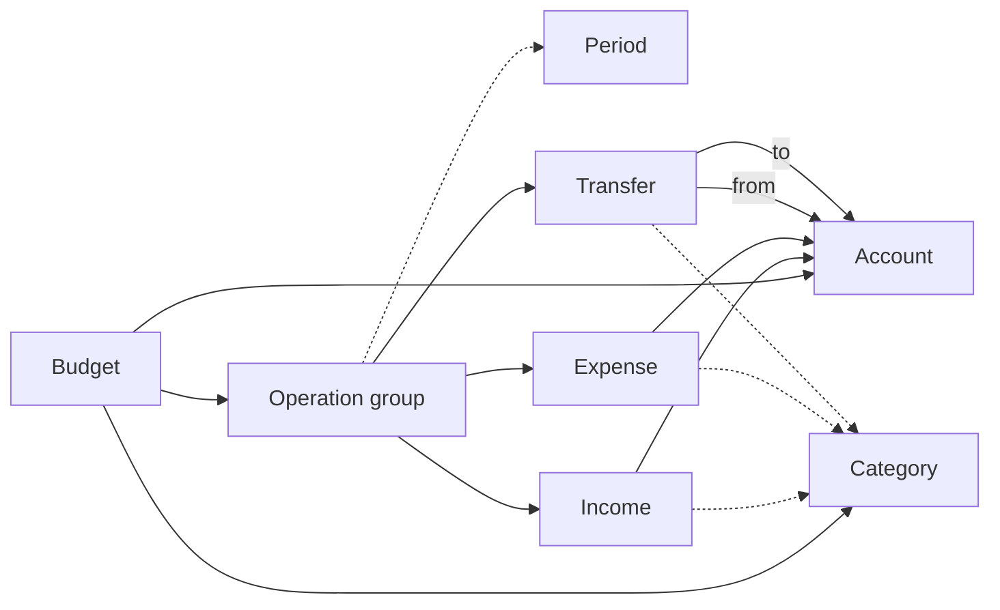

# Domain Model

## Security

The Security domain describes a person recognized by the system and the information associated with that person.

### User

A user has an identity, a role ID, an email address, a phone number, a password credential, a first name, and a last name. The identity distinguishes one user from another. The role ID identifies the user's role. Contact details and names may change without changing that identity.

The application `UserService` creates users with a generated UUID and a hashed password. Updates replace the role, contact details, and names; omitting a new password preserves the current hash. Deletion uses the user ID. The service validates inputs before accessing the repository.

### Role

A role has an ID, a translated name, and a list of permissions. The name contains at least one translation. A role may have no permissions.
Each permission in the list must be one of the defined permissions.

### Permission

A permission names an action the system may authorize. The initial permissions
are `PermissionManageUser` and `PermissionViewUser`.

### Rules

- An email address identifies one mailbox. It cannot include a display name or surrounding whitespace.
- A phone number uses international notation: a plus sign followed by 2 to 15 digits, with a nonzero first digit. Spaces and punctuation are not allowed.
- The password credential is stored as a nonempty hash. `PasswordHasher` rejects empty passwords when hashing and verifies candidates against stored credentials. The Argon2id implementation uses 64 MiB, three passes, four lanes, a random 16-byte salt, and a 32-byte derived key. Its encoded hash includes the algorithm version and parameters.
- First and last names must each contain a non-whitespace character and be no longer than 100 characters.
- An invalid change to contact details, the credential, a name, a role ID, or role permissions leaves the existing value intact.
- Role IDs must be nonzero UUIDs.

Authentication flows and sessions are outside the current Security model.

## Languages

A language has a code, English and native names, and an `IsFallback` flag. The fallback identifies the language to use when the requested translation is missing. Languages default to non-fallback, and at most one language may be the fallback.

`LanguageRepository.FindFallback` returns the configured fallback or `ErrLanguageNotFound` when none exists. Creating a second fallback returns `ErrFallbackLanguageAlreadyExists`. A fallback used by existing translations cannot be deleted or unset; attempts return `ErrFallbackLanguageAlreadyInUse`. These rules are enforced in PostgreSQL as well as during application creation. The existing restriction on deleting any language with translations still applies.

## Finance

### Purpose

The planner describes a budget over one or more periods. A budget contains opening account balances and planned operations grouped by period.

Its calculation results are income, expenses, and balances by account and category for each period and for the budget as a whole.

The budget is the aggregate root: accounts and categories referenced by an operation must belong to that budget.

### Entities

#### Budget

A budget brings together the accounts, categories, and operations needed for its calculation periods. It has an optional title, a display language, zero or more currency declarations, ordered accounts and categories, and any number of operation groups.

Account and category order matters when presenting operations: accounts appear in their declared order, followed by categories in their declared order within each account. Uncategorized operations appear after the declared categories for their account.

The title identifies the budget in its results, and the language determines the labels shown to the user. Monetary values use the symbol of the first declared currency. Accounts and operations do not currently have separate currencies.

#### Account

An account represents a place where money is held, such as a bank account, cash, or another wallet. It has a unique, nonempty identifier, a display name, and an opening balance that defaults to zero.

The opening balance may be positive, zero, or negative. Income and expense operations each affect one account; a transfer affects a source and a destination account.

#### Category

A category classifies operations by purpose. It has a unique, nonempty identifier, a display name, and one of three kinds: income, expense, or transfer.

The category kind must match the operation kind. Categories are optional for operations; amounts without a category are tracked separately as uncategorized.

#### Period and operation group

An operation group contains operations for an optional calendar period. A period may be a year, a month within a year, or a range with two year or month boundaries. For example, September 2026 through October 2026 is one range; 2026 through 2027 is another. A range does not itself repeat or multiply its operations.

Each period can have at most one operation group in a budget. At most one group can have no period. Any number of groups, including zero, is allowed.

Periods are considered in the order their groups are defined. Operations and amounts from different periods remain separate. A group without a period forms its own separate result.

Account balances carry forward in period order. The first period starts with each account's declared opening balance. Each later period starts with that account's closing balance from the previous period.

For each account, net change is period income minus period expenses. Closing balance is opening balance plus net change.

#### Operation

An operation is a planned movement of money. It has an optional description, a nonnegative amount per unit, an optional nonnegative whole-number repetition count, an optional matching category, optional dates, and membership in an operation group.

The repetition count defaults to one. The effective amount is the amount per unit multiplied by that count; a count of zero produces an effective amount of zero. Monetary calculations are exact, without binary floating-point rounding.

Dates describe when an operation is planned, but do not affect its amount.

##### Income

Income credits the effective amount to one account. It increases both that account's balance and the budget's overall balance.

##### Expense

An expense debits the effective amount from one account. It decreases both that account's balance and the budget's overall balance.

##### Transfer

A transfer moves the effective amount from one account to another. It decreases the source account's balance and increases the destination account's balance by the same amount. It is not external income or expense and does not change the budget's overall balance.

### Calculations

For each period, an account's closing balance is its opening balance plus income minus expenses. The budget's overall closing balance is the sum of account opening balances plus external income minus external expenses.

The budget summary totals income and expenses across all periods. Its closing balances reflect the cumulative effect of those periods in order.

### Aggregation

For each period and for the budget summary, the results include:

- each account's opening balance, income, expenses, net change, and closing balance;
- totals for income, expense, and transfer categories;
- totals for uncategorized operations;
- overall external income and expenses;
- the budget's overall closing balance.

Categories with no amount are omitted from the results. Transfers appear in individual account figures and transfer categories, but are excluded from overall external income and expenses.

### Invariants

A valid budget follows these rules:

1. Accounts and categories have nonempty identifiers that are unique within their respective kinds.
2. An account's opening balance is a finite number.
3. Each period has at most one operation group, and at most one group has no period.
4. A period has one or two boundaries, each identifying a year or a month within a year.
5. Income and expenses refer to an account in the budget.
6. Transfers refer to source and destination accounts in the budget.
7. An operation's category belongs to the budget and matches its kind.
8. An operation's amount is nonnegative.
9. The repetition count is a nonnegative whole number.
10. A budget has at most one title and one display language.

### Example

Consider a budget with a bank account opening at 250 and a cash account opening at zero. In one period, the bank receives 1,500 in salary, pays 100 for insurance, and transfers 200 to cash.

The bank closes at 1,450: 250 + 1,500 − 100 − 200. Cash closes at 200. The overall budget closes at 1,650. The transfer changes where the money is held but has no effect on the overall balance.
