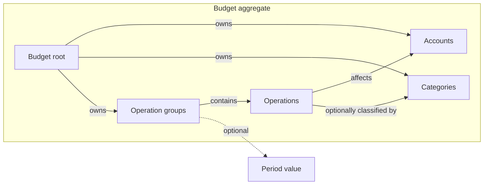

# Budget

The Budget domain models opening account balances and planned movements of
money grouped by calendar period. Its results describe income, expenses, and
balances for each period and for the Budget as a whole.

## Model structure

| Concept | Classification | Boundary and relationships |
| --- | --- | --- |
| Budget | Aggregate root | Owns Accounts, Categories, and Operation groups; defines their common calculation boundary. |
| Account | Entity within Budget | Identified within its Budget; holds an opening balance and receives movements of money. |
| Category | Entity within Budget | Identified within its Budget; classifies Operations of one kind. |
| Operation group | Owned component within Budget | Contains ordered Operations and an optional Period; has no separately defined identity. |
| Operation | Owned component within an Operation group | Represents Income, Expense, or Transfer; references Accounts and an optional Category within its Budget. |
| Account and category identities | Value objects | Identify entities within their respective kinds in a Budget. |
| Monetary amount, repetition count, operation kind | Value objects | Describe an Operation's amount, multiplicity, and effect. |
| Period, period boundary, planned date, currency declaration | Value objects | Describe time and monetary notation without an independent lifecycle. |
| Calculation results | Derived values | Summarize the Budget's planned movements without changing its entities. |

## Aggregate and entities

### Budget

The Budget is the consistency boundary for its Accounts, Categories, and
Operations. Referenced Accounts and Categories must belong to this Budget.

| Field | Domain value | Required | Meaning and rules |
| --- | --- | --- | --- |
| Title | Text | No | Names the Budget; at most one title. |
| Display language | Language choice | No | Determines the language of labels; at most one choice. |
| Currencies | Ordered collection of currency declarations | No | The first declared currency supplies the monetary symbol shared by Accounts and Operations. |
| Accounts | Ordered collection of Account entities | Yes; may be empty | Defines the places where money is held; identities are unique within this collection. |
| Categories | Ordered collection of Category entities | Yes; may be empty | Defines classifications for Operations; identities are unique within this collection. |
| Operation groups | Ordered collection of Operation groups | Yes; may be empty | Defines calculation order; at most one group per Period and at most one without a Period. |

Account order is preserved when presenting Operations. Within each Account,
Categories follow their declared order, with uncategorized Operations last.
Accounts and Operations have no separate currencies.

### Account

An Account represents a place where money is held. Its identity is local to the
Budget and remains the same when its name or opening balance changes.

| Field | Domain value | Required | Meaning and rules |
| --- | --- | --- | --- |
| Identity | Account identity | Yes | Nonempty and unique among this Budget's Accounts. |
| Name | Text | Yes | Gives the Account's display name. |
| Opening balance | Monetary amount | No; defaults to zero | Initial amount held in the Account; finite and may be positive, zero, or negative. |

### Category

A Category classifies Operations by purpose. Its identity is local to the
Budget.

| Field | Domain value | Required | Meaning and rules |
| --- | --- | --- | --- |
| Identity | Category identity | Yes | Nonempty and unique among this Budget's Categories. |
| Name | Text | Yes | Gives the Category's display name. |
| Kind | Operation kind | Yes | Income, Expense, or Transfer; must match every Operation assigned to this Category. |

## Owned components

### Operation group

An Operation group associates planned Operations with an optional Period.
Groups are considered in their declared order. A group without a Period has
its own separate result.

| Field | Domain value | Required | Meaning and rules |
| --- | --- | --- | --- |
| Period | Period | No | Determines the group's calendar scope; unique among this Budget's groups when present. |
| Operations | Ordered collection of Operations | Yes; may be empty | Contains the planned movements belonging to this group. |

### Operation

An Operation belongs to one Operation group. Its kind determines which Account
references it requires and how its effective amount affects balances.

| Field | Domain value | Required | Meaning and rules |
| --- | --- | --- | --- |
| Kind | Operation kind | Yes | Income, Expense, or Transfer. |
| Description | Text | No | Describes the planned movement. |
| Amount per unit | Monetary amount | Yes | Nonnegative amount for one repetition. |
| Repetition count | Repetition count | No; defaults to one | Nonnegative whole number multiplying the amount per unit. |
| Category | Category identity | No | References a Category in this Budget with the same kind; absence means uncategorized. |
| Planned dates | Collection of planned dates | No | Describes when the movement is planned; does not affect its amount. |
| Account | Account identity | For Income and Expense | References the Account credited by Income or debited by Expense. |
| Source account | Account identity | For Transfer | References the Account from which money moves. |
| Destination account | Account identity | For Transfer | References the Account to which money moves. |

Every Account reference must resolve within the owning Budget.

| Kind | Effect on Accounts | Effect on overall Budget balance |
| --- | --- | --- |
| Income | Credits the effective amount to one Account. | Increases the balance by that amount. |
| Expense | Debits the effective amount from one Account. | Decreases the balance by that amount. |
| Transfer | Debits the source and credits the destination by the same amount. | No change; not external income or expense. |

## Value objects

### Scalar values

| Value object | Field | Meaning and rules |
| --- | --- | --- |
| Account identity | Identity value | Nonempty reference to one Account within a Budget. |
| Category identity | Identity value | Nonempty reference to one Category within a Budget. |
| Monetary amount | Amount | Finite, exact monetary quantity; sign restrictions depend on its use. |
| Repetition count | Count | Nonnegative whole number; zero produces an effective amount of zero. |
| Operation kind | Kind | One of Income, Expense, or Transfer. |
| Planned date | Calendar date | Indicates when an Operation is planned without changing its amount. |
| Currency declaration | Symbol | Defines monetary notation; the first declaration supplies the Budget's shared symbol. |

### Period

A Period identifies a year, a month within a year, or a range between two year
or month boundaries. Its value determines whether two groups have the same
Period. A range does not repeat or multiply its Operations.

| Field | Domain value | Required | Meaning and rules |
| --- | --- | --- | --- |
| First boundary | Period boundary | Yes | Identifies the year or month, or the beginning boundary of a range. |
| Second boundary | Period boundary | No | Identifies the other boundary when the Period is a range. |

### Period boundary

| Field | Domain value | Required | Meaning and rules |
| --- | --- | --- | --- |
| Year | Calendar year | Yes | Identifies the year containing the boundary. |
| Month | Calendar month | No | Narrows the boundary to a month within the year; absent for a whole-year boundary. |

## Derived calculation values

### Effective amount

| Field | Domain value | Meaning and rules |
| --- | --- | --- |
| Effective amount | Monetary amount | Amount per unit multiplied by repetition count; calculated exactly. |

### Account result

An Account result describes one Account for one Operation group or for the
Budget summary. Incoming Transfers contribute to Account income, and outgoing
Transfers contribute to Account expenses.

| Field | Domain value | Meaning and rules |
| --- | --- | --- |
| Account | Account identity | Identifies the Account summarized. |
| Opening balance | Monetary amount | Starts from the declared balance for the first group and the preceding group's closing balance thereafter. |
| Income | Monetary amount | Total credits from Income and incoming Transfers. |
| Expenses | Monetary amount | Total debits from Expenses and outgoing Transfers. |
| Net change | Monetary amount | Income minus expenses. |
| Closing balance | Monetary amount | Opening balance plus net change. |

The Budget summary uses the Account's original opening balance, totals its
income and expenses across all groups, and ends at its final closing balance.

### Category total

| Field | Domain value | Meaning and rules |
| --- | --- | --- |
| Category | Category identity | Identifies the Category summarized. |
| Kind | Operation kind | Distinguishes Income, Expense, and Transfer totals. |
| Total amount | Monetary amount | Sum of effective amounts assigned to the Category in the result's scope. |

Categories with no amount are omitted. Uncategorized amounts are tracked
separately. Transfer category totals describe internal movement, not external
income or expenses.

### Group result and Budget summary

A group result summarizes one Operation group. The Budget summary combines all
groups in their declared order.

| Field | Domain value | Meaning and rules |
| --- | --- | --- |
| Period | Period, when present | Identifies a group result's calendar scope; absent for the undated group and the Budget summary. |
| Account results | Collection of Account results | Gives opening balance, income, expenses, net change, and closing balance by Account. |
| Category totals | Collection of Category totals | Gives totals by Category and kind, excluding Categories with no amount. |
| Uncategorized totals | Monetary totals | Tracks amounts for Operations without a Category. |
| External income | Monetary amount | Total Income, excluding Transfers. |
| External expenses | Monetary amount | Total Expenses, excluding Transfers. |
| Overall closing balance | Monetary amount | Sum of Account closing balances; also equals overall opening balance plus external income minus external expenses. |

## Aggregate invariants

- Account and Category identities are nonempty and unique within their
  respective collections.
- Every referenced Account and Category belongs to the owning Budget.
- An Operation's Category, when present, matches its kind.
- Each Period has at most one Operation group; at most one group has no Period.
- A Period has one or two year or month boundaries.
- Opening balances are finite; Operation amounts are nonnegative.
- Repetition counts are nonnegative whole numbers.
- A Budget has at most one title and one display language.
- Balances carry forward in group order, preserving exact amounts.
- Transfers preserve the Budget's overall balance and do not contribute to
  external income or expenses.
