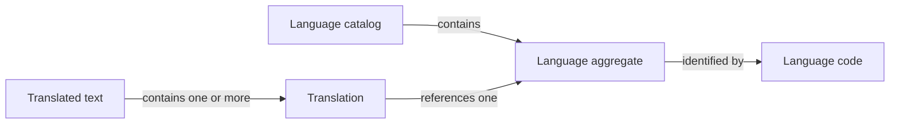

# Languages

The Languages domain models the language catalog, translated text, and the
fallback used when a requested translation is missing.

## Model structure

| Concept | Classification | Boundary and relationships |
| --- | --- | --- |
| Language | Entity and aggregate root | Identified by its language code; owns English and native names and a fallback designation. |
| Language catalog | Collection of Language aggregates | Defines available languages and the rule that at most one is the fallback. |
| Language code | Value object | Identifies a Language and associates a translation with that Language. |
| English name and native name | Value objects | Name a Language without identifying a separate entity. |
| Translation | Value object | Associates text with one Language; belongs to a translated text value. |
| Translated text | Composite value object | Contains one or more language-specific translations; belongs to the concept it names. |

## Language aggregate

A Language retains its identity when its names or fallback designation change.
Translations reference Languages; they are owned by the translated text they
belong to, rather than by the Language aggregate.

| Field | Domain value | Required | Meaning and rules |
| --- | --- | --- | --- |
| Code | Language code | Yes | Identifies the Language uniquely within the catalog. |
| English name | English name | Yes | Names the Language in English; nonblank and at most 100 characters. |
| Native name | Native name | Yes | Names the Language in that Language; nonblank and at most 100 characters. |
| Fallback designation | Yes or no | Yes | Defaults to no; when yes, identifies the language used when a requested translation is missing. |

## Value objects

### Language values

| Value object | Field | Meaning and rules |
| --- | --- | --- |
| Language code | Code value | Exactly two lowercase Latin letters; identifies a Language within the catalog. |
| English name | Name text | Valid text containing a non-whitespace character; at most 100 characters. |
| Native name | Name text | Valid text containing a non-whitespace character; at most 100 characters. |

### Translation

A Translation expresses text in one Language. It has no identity independent
of its language and content.

| Field | Domain value | Required | Meaning and rules |
| --- | --- | --- | --- |
| Language | Language code | Yes | References the Language in which the content is expressed. |
| Content | Text | Yes | Valid text containing a non-whitespace character. |

### Translated text

Translated text is a value owned by the domain concept it describes.
[Role names](users.md#role) use this value with an additional length limit
for each translation.

| Field | Domain value | Required | Meaning and rules |
| --- | --- | --- | --- |
| Translations | Collection of translations | Yes | At least one Translation, with at most one per Language. |

When a requested language has no Translation, the fallback language supplies
the translation. The catalog may have no fallback Language.

## Invariants across aggregates

- Language codes are unique within the catalog.
- Every Translation refers to a Language in the catalog.
- At most one Language is designated as the fallback.
- A Language used by any Translation cannot be deleted.
- A fallback Language used by existing Translations cannot have its fallback
  designation removed.
