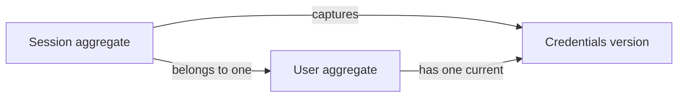

# Security

The Security domain models authenticated access: how a User's identity is
established, how that access continues on a device, and how it ends.
Authentication establishes identity; the [Users](users.md) domain defines the
accounts, roles, and permissions that authorization evaluates.

## Model structure

| Concept | Classification | Boundary and relationships |
| --- | --- | --- |
| Session | Entity and aggregate root | Represents one device's authenticated access; references one [User](users.md#user) and the [credentials version](users.md#account-and-authority-values) accepted at sign-in. |
| Session identity | Value object | Identifies one Session independently of its other fields. |

## Aggregates and entities

### Session

A Session represents one User's authenticated access from a device. A User may
have multiple Sessions. The referenced User has its own lifecycle and is
outside the Session aggregate.

| Field | Domain value | Required | Meaning and rules |
| --- | --- | --- | --- |
| Identity | Session identity | Yes | Distinguishes this Session from all other Sessions; nonempty and stable. |
| User | User identity | Yes | References the User whose identity was established at sign-in. |
| Credentials version | Credentials version | Yes | Captures the User's credentials version at sign-in; must match the User's current version for the Session to authenticate. |
| Expires at | Moment | Yes | Defines the deadline after which the Session cannot authenticate the User; never extended after sign-in. |

A Session begins when a User proves their identity, and it is the only way
that identity carries over to later actions on the same device. Possessing a
Session's identity alone does not establish authentication.

## Value objects

| Value object | Field | Meaning and rules |
| --- | --- | --- |
| Session identity | Identity value | Nonempty identity of one Session. |

## Invariants

- A Session authenticates its User only while it is unexpired, has not been
  ended, and holds the User's current credentials version.
- A missing or deleted User cannot be authenticated by any Session.
- Ending one Session does not affect the User's other Sessions.
- Ending all of a User's Sessions replaces the User's credentials version, so
  every existing Session of that User stops authenticating, however its access
  is carried.
- A change to the User's email or password replaces the credentials version
  and therefore ends all of the User's existing Sessions, including the current
  one.
- An ended or invalidated Session never becomes valid again, including after
  the User signs in again; signing in always begins a new Session.
- Changes to a User's Role, its permissions, or its super designation affect
  authority during existing Sessions without ending them.
