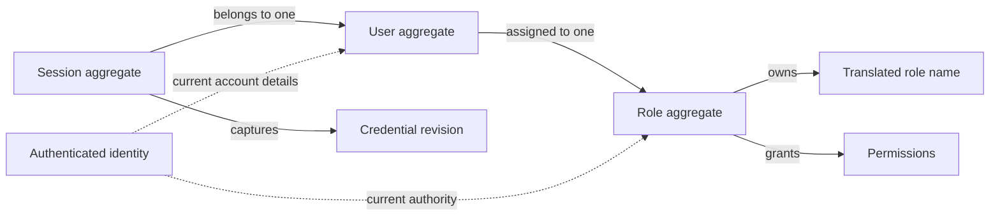

# Security

The Security domain models users, their credentials, and the authority granted
through roles. Authentication establishes identity; authorization determines
whether an action is permitted.

## Model structure

| Concept | Classification | Boundary and relationships |
| --- | --- | --- |
| User | Entity and aggregate root | Owns account details and a password credential; references one Role. |
| Role | Entity and aggregate root | Owns a translated name, assigned permissions, and a super designation; may be referenced by many Users. |
| Session | Entity and aggregate root | Represents one device's authenticated access; references one User and the credential revision accepted at sign-in. |
| Authentication state | Domain snapshot | Combines a User with the current credential revision used to determine session validity. |
| Authenticated identity | Derived value object | Describes the current User and authority established through a valid Session. |
| User, role, and session identities | Value objects | Identify their respective entities independently of mutable details. |
| Email, phone, personal names, password, password credential | Value objects | Describe account values and their individual validity rules. |
| Role name, permission, credential revision | Value objects | Describe translated naming, allowed actions, and the validity of existing credentials. |

## Aggregates and entities

### User

A User represents one person recognized by the system. Its identity remains the
same when account details, role, or password change. The referenced Role has its
own lifecycle and is outside the User aggregate.

| Field | Domain value | Required | Meaning and rules |
| --- | --- | --- | --- |
| Identity | User identity | Yes | Distinguishes this User from all other Users; nonempty and stable. |
| Role | Role identity | Yes | References one existing Role and determines the User's authority. |
| Email | Email address | Yes | Identifies the User's mailbox; unique among Users without regard to letter case. |
| Email changed at | Moment | Yes | Records the most recent change to the email address. |
| Phone | Phone number | Yes | Gives the User's contact number in international notation. |
| Phone changed at | Moment | Yes | Records the most recent change to the phone number. |
| Password credential | Password credential | Yes | Provides the basis for verifying the User's password; nonempty. |
| Password changed at | Moment | Yes | Records the most recent change to the password credential. |
| First name | First name | Yes | Gives the User's first name. |
| Last name | Last name | Yes | Gives the User's last name. |
| Created at | Moment | Yes | Records when the account was created. |
| Updated at | Moment | Yes | Records the latest account change; an update based on outdated details must not overwrite a newer change. |

Changing names, phone, or Role does not require changing the password.

### Role

A Role defines authority shared by its assigned Users. Its name uses the
[translated text value object](languages.md#translated-text); each translation
is limited to 100 characters.

| Field | Domain value | Required | Meaning and rules |
| --- | --- | --- | --- |
| Identity | Role identity | Yes | Distinguishes this Role from all other Roles; nonempty and stable. |
| Name | Translated role name | Yes | Contains at least one nonblank translation, with at most one per language. |
| Permissions | Collection of permissions | Yes; may be empty | Lists explicitly granted actions; every entry must be a defined permission. |
| Super designation | Yes or no | Yes | Defaults to no; when yes, grants every defined permission. |

A Role assigned to any User cannot be deleted. An ordinary Role grants only its
assigned permissions. Changes to a User's Role, its permissions, or its super
designation affect authority during existing Sessions.

### Session

A Session represents one User's authenticated access from a device. A User may
have multiple Sessions. Ending one Session does not end the User's other
Sessions; ending all Sessions invalidates all existing access for that User.

| Field | Domain value | Required | Meaning and rules |
| --- | --- | --- | --- |
| Identity | Session identity | Yes | Distinguishes this device Session from other Sessions; nonempty. |
| User | User identity | Yes | References the User whose identity was established at sign-in. |
| Credential revision | Credential revision | Yes | Captures the account's credential revision at sign-in; must match the current revision for authentication. |
| Expires at | Moment | Yes | Defines the deadline after which the Session cannot authenticate the User. |

A Session must be unexpired and unrevoked to establish an authenticated
identity. A missing or deleted User cannot be authenticated. Changes to email
or password and account-wide sign-out invalidate existing Sessions. Signing in
again does not restore an invalidated Session.

## Value objects

### Account and authority values

These values have no independent lifecycle. Their meaning is determined by
their content rather than a separate entity identity.

| Value object | Field | Meaning and rules |
| --- | --- | --- |
| User identity | Identity value | Nonempty identity of one User. |
| Role identity | Identity value | Nonempty identity of one Role. |
| Session identity | Identity value | Nonempty identity of one Session. |
| Email address | Mailbox address | Identifies exactly one mailbox; no display name or surrounding whitespace. |
| Phone number | International number | A plus sign followed by 2 to 15 digits; first digit nonzero; no spaces or punctuation. |
| First name | Name text | Valid text with a non-whitespace character; at most 100 characters. |
| Last name | Name text | Valid text with a non-whitespace character; at most 100 characters. |
| Password | Secret text | A new password is valid text with a non-whitespace character, at least six characters, and at most 4096 bytes. |
| Password credential | Verification value | Nonempty value used to verify a password; distinct from the password supplied by the User. |
| Role name | Translated text | At least one translation; each is nonblank and at most 100 characters. |
| Permission | Authorized action | One of managing Users, viewing Users, managing Roles, or viewing Roles. |
| Credential revision | Revision identity | Nonempty value identifying the account's current authentication state; a changed revision invalidates Sessions holding the previous value. |

Permissions are independent. Permission to manage Users or Roles does not
implicitly grant permission to view them, and a Role's name grants no authority.

### Authenticated identity

An authenticated identity is a derived value describing the User and current
authority. It has no independent lifecycle and contains no password credential.
Account details alone do not establish authentication.

| Field | Domain value | Meaning and rules |
| --- | --- | --- |
| User | User identity | Identifies the authenticated User. |
| Role | Role identity | Identifies the User's current Role. |
| Permissions | Collection of permissions | Contains the Role's currently assigned permissions. |
| Super designation | Yes or no | Reflects the Role's current designation; grants every defined permission when yes. |
| First name | First name | Carries the User's current first name. |
| Last name | Last name | Carries the User's current last name. |
| Email | Email address | Carries the User's current mailbox address. |
| Phone | Phone number | Carries the User's current contact number. |

## Authentication state

Authentication state describes the account and credential revision against
which a Session is evaluated. It is a snapshot of the User, not another User
entity, and knowing it alone does not establish authentication.

| Field | Domain value | Meaning and rules |
| --- | --- | --- |
| User | User | Describes the account whose credentials are being checked. |
| Credential revision | Credential revision | Identifies the current authentication state; Sessions with another revision are invalid. |
