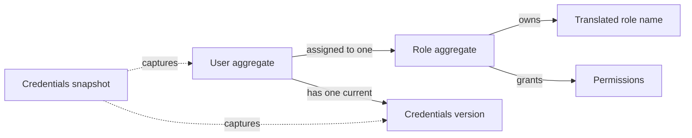

# Users

The Users domain models users, their credentials, and the authority granted
through roles. Authorization determines whether an action is permitted;
authenticated access is modeled in the [Security](security.md) domain.

## Model structure

| Concept | Classification | Boundary and relationships |
| --- | --- | --- |
| User | Entity and aggregate root | Owns account details and a password credential; references one Role. |
| Role | Entity and aggregate root | Owns a translated name, assigned permissions, and a super designation; may be referenced by many Users. |
| Credentials snapshot | Domain snapshot | Combines a User with the current credentials version used to determine [Session](security.md#session) validity. |
| User and role identities | Value objects | Identify their respective entities independently of mutable details. |
| Email, phone, personal names, password, password credential | Value objects | Describe account values and their individual validity rules. |
| Role name, permission, credentials version | Value objects | Describe translated naming, allowed actions, and the validity of existing credentials. |

## Aggregates and entities

### User

A User represents one person recognized by the system. Its identity remains the
same when account details, role, or password change. The referenced Role has its
own lifecycle and is outside the User aggregate.

| Field | Domain value | Required | Meaning and rules |
| --- | --- | --- | --- |
| Identity | User identity | Yes | Distinguishes this User from all other Users; nonempty and stable. |
| Role | Role identity | Yes | References one existing Role and determines the User's authority. |
| Email | Email address | Yes | Identifies the User's mailbox; unique among Users without regard to letter case. |
| Email changed at | Moment | Yes | Records the most recent change to the email address. |
| Phone | Phone number | Yes | Gives the User's contact number in international notation. |
| Phone changed at | Moment | Yes | Records the most recent change to the phone number. |
| Password credential | Password credential | Yes | Provides the basis for verifying the User's password; nonempty. |
| Password changed at | Moment | Yes | Records the most recent change to the password credential. |
| First name | First name | Yes | Gives the User's first name. |
| Last name | Last name | Yes | Gives the User's last name. |
| Created at | Moment | Yes | Records when the account was created. |
| Updated at | Moment | Yes | Records the latest account change; an update based on outdated details must not overwrite a newer change. |

Changing names, phone, or Role does not require changing the password.
Changing the email or password replaces the User's credentials version, which
ends the User's existing [Sessions](security.md#session).

### Role

A Role defines authority shared by its assigned Users. Its name uses the
[translated text value object](languages.md#translated-text); each translation
is limited to 100 characters.

| Field | Domain value | Required | Meaning and rules |
| --- | --- | --- | --- |
| Identity | Role identity | Yes | Distinguishes this Role from all other Roles; nonempty and stable. |
| Name | Translated role name | Yes | Contains a nonblank translation in the [fallback language](languages.md#language-aggregate) when the catalog has one; other translations are optional, with at most one per language. Without a fallback language, at least one nonblank translation is required. |
| Permissions | Collection of permissions | Yes; may be empty | Lists explicitly granted actions; every entry must be a defined permission. |
| Super designation | Yes or no | Yes | Defaults to no; when yes, grants every defined permission. |

A Role assigned to any User cannot be deleted. An ordinary Role grants only its
assigned permissions. Changes to a User's Role, its permissions, or its super
designation affect authority during existing
[Sessions](security.md#session).

## Value objects

### Account and authority values

These values have no independent lifecycle. Their meaning is determined by
their content rather than a separate entity identity.

| Value object | Field | Meaning and rules |
| --- | --- | --- |
| User identity | Identity value | Nonempty identity of one User. |
| Role identity | Identity value | Nonempty identity of one Role. |
| Email address | Mailbox address | Identifies exactly one mailbox; no display name or surrounding whitespace. |
| Phone number | International number | A plus sign followed by 2 to 15 digits; first digit nonzero; no spaces or punctuation. |
| First name | Name text | Valid text with a non-whitespace character; at most 100 characters. |
| Last name | Name text | Valid text with a non-whitespace character; at most 100 characters. |
| Password | Secret text | A new password is valid text with a non-whitespace character, at least six characters, and at most 4096 bytes. |
| Password credential | Verification value | Nonempty value used to verify a password; distinct from the password supplied by the User. |
| Role name | Translated text | Includes the fallback language translation when the catalog has a fallback language, otherwise at least one translation; each translation is nonblank and at most 100 characters. |
| Permission | Authorized action | One of managing Users, viewing Users, managing Roles, or viewing Roles. |
| Credentials version | Version identity | Nonempty value identifying the current state of the User's email and password; replaced whenever either changes or all of the User's Sessions end, and never reused. A replaced version invalidates [Sessions](security.md#session) holding it. |

Permissions are independent. Permission to manage Users or Roles does not
implicitly grant permission to view them, and a Role's name grants no authority.

### Authority during authenticated access

Who is acting through a [Session](security.md#session), and with what
authority, is described by the Security domain's
[authenticated identity](security.md#authenticated-identity). It carries the
User's current account details and current Role; account details alone do not
establish authentication.

## Credentials snapshot

A credentials snapshot describes a User together with the credentials version
current at the same moment, so the password credential it carries is the one
that version describes. It is a snapshot of the User, not another User entity,
and knowing it alone does not establish authentication. A Session begun from a
snapshot captures its credentials version.

| Field | Domain value | Meaning and rules |
| --- | --- | --- |
| User | User | Describes the account whose credentials are being checked. |
| Credentials version | Credentials version | Identifies the state of the User's email and password at the moment of the snapshot; Sessions with another version are invalid. |
